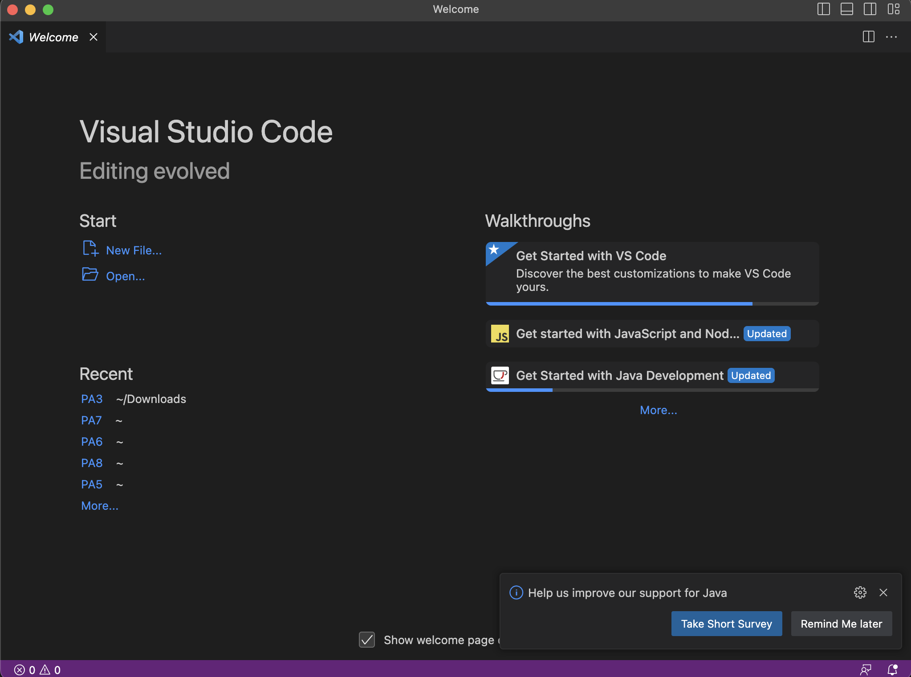
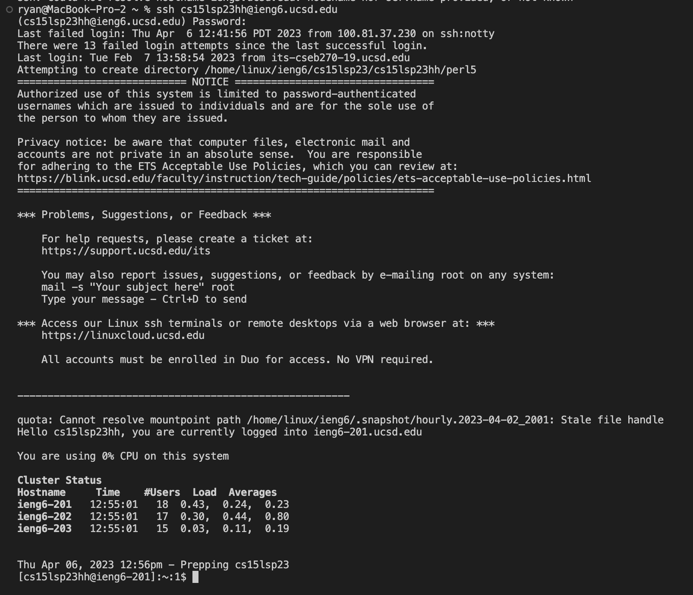
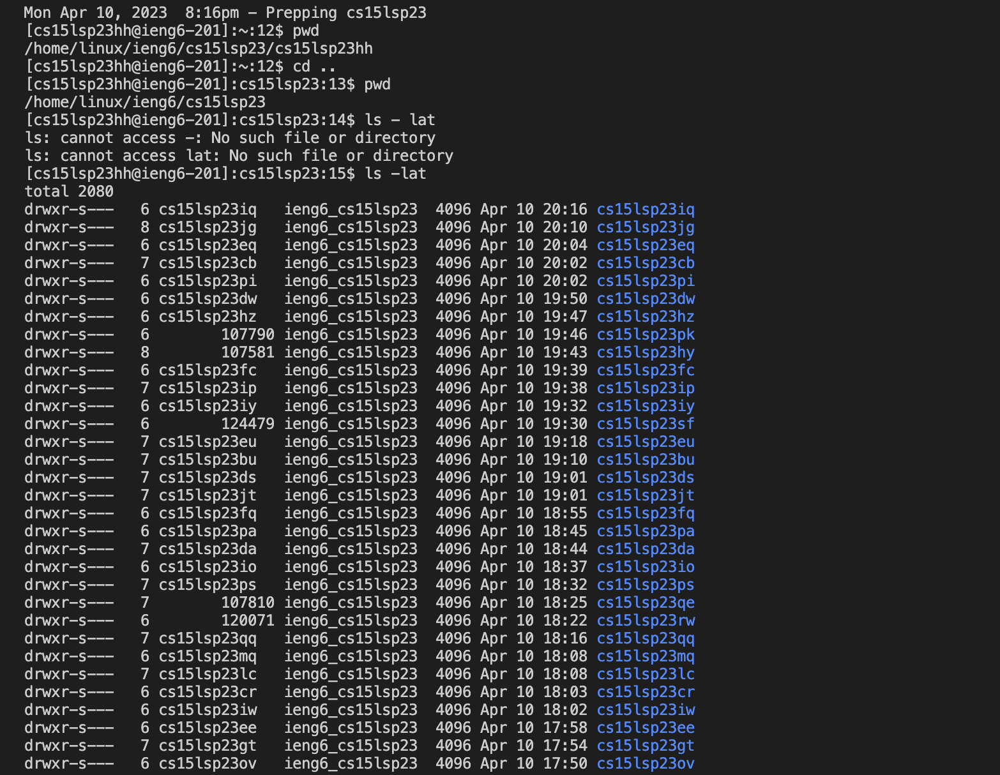
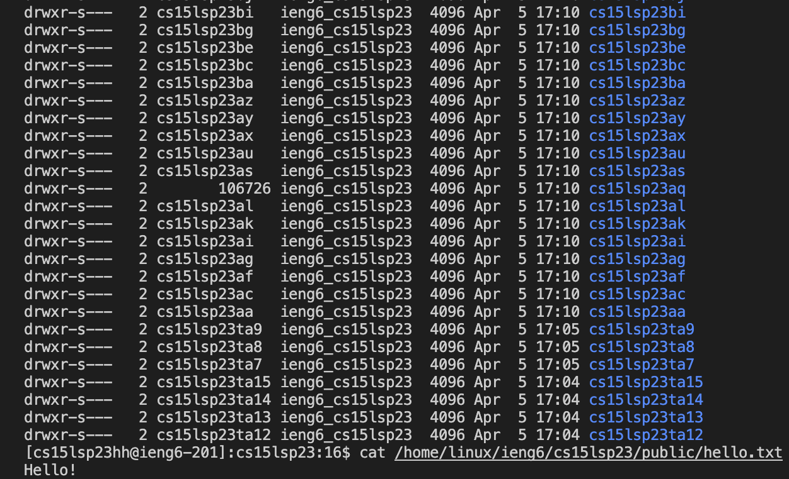

This is my Lab report for Week 1 CSE 15L lab session that happened on 04/06/2023

**Step 1: Installing VSCode**



Above is a screenshot of the startup page of VSCode taken on my personal computer. Since I used VSCode in CSE 11, I had it pre downloaded and could skip the instructions to download it. I just ran the application and the above is the screen that pops up soon after. From there, I clicked on Terminal --> New Terminal and that allowed me to move forward with my lab work for the day.
However, if my computer did not have VSCode pre-downloaded, the link to download it is [HERE](https://code.visualstudio.com/). Post this, select the operating system, and install on local computer after downloading.


**Step 2: Remotely Connecting**



Above shows the screenshot of the screen post successfully remotely connecting to the server. Since I was on a mac, I was able to skip the steps pertaining to downloading git for windows and installing git bash. To find my student account for this course, I clicked on [THIS LINK](https://sdacs.ucsd.edu/~icc/index.php). Then, I logged in using my UCSD credentials and picked the account for CSE 15L. That gave me my username - **cs15lsp23hh**. I looked up the [TUTORIAL](https://drive.google.com/file/d/17IDZn8Qq7Q0RkYMxdiIR0o6HJ3B5YqSW/view) for resetting the password for this account and went to the Global Password Change Tool. I followed the instructions mentioned in the tutorial and using duo authentication, was successfully able to change my password. Now, onto the ```ssh```.
I used the command $ ```ssh cs15lsp23hh@ieng6.ucsd.edu``` to securely connect to the remote server and entered my password. It then successfully connected me onto my student account for this course, displaying useful information like latest failed logins, the notice, cluster status and the CPU usage.

**Step 3: Trying some Commands**






Above are screenshots of the output when I used some of the commands that we learnt in class. 
1. ```pwd``` - prints the current directory
2. ```ls -lat``` - lists all the files in the current directory 
3. ```cd``` - changes my current directory to the home directory
4. ```..``` - takes us to the parent directory
5. ```cat /home/linux/ieng6/cs15lsp23/public/hello.txt``` - concatenates or prints the contents of the hello.txt file stored at the path given.

By using some of these commands in combination, I have bolstered my knowledge of their working over the course of this lab.
