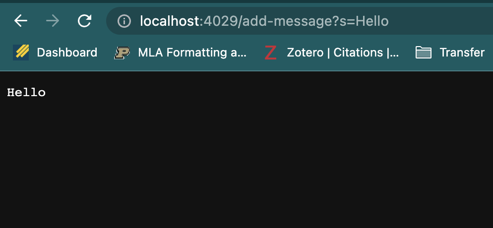

## **PART 1**

In Part 1, I will create a web server called ``StringServer`` that supports the path and behavior described in [Lab Report 2 - Servers and Bugs (Week 3)](https://ucsd-cse15l-s23.github.io/week/week3/#week3-lab-report). The ``StringServer`` class keeps track of a string and responds with it every time the URI is visited. The requests in the URI look like ```/add-message?s=<string>``` and every time it runs, the new string is printed on a new line using ``("\n")``

The Code for StringServer is as follows. I have used a lot of the code from the Lab 2 wavelet repository and made modifications in accordance with the requirements of this web server.

```
import java.io.IOException;
import java.net.URI;

class Handler implements URLHandler {
    // The one bit of state on the server: a number that will be manipulated by
    // various requests.
    String s = "";
    String test = "hi";

    public String handleRequest(URI url) {
        if (url.getPath().equals("/")) {
            return String.format("");
        } 
        else {
            System.out.println("Path: " + url.getPath());
            if (url.getPath().contains("/add-message")) {
                String[] parameters = url.getQuery().split("=");
                
                if (parameters[0].equals("s"))
                {
                    s+= parameters[1]+"\n";
                }
                return s;
            }
            return "404 Not Found!";
        }
    }
}

class StringServer {
    public static void main(String[] args) throws IOException {
        if(args.length == 0){
            System.out.println("Missing port number! Try any number between 1024 to 49151");
            return;
        }

        int port = Integer.parseInt(args[0]);

        Server.start(port, new Handler());
    }
}
```

After writing this code, committing and pushing it, I compiled the java files and started the server, using the techniques taught in [LAB 2](https://ucsd-cse15l-s23.github.io/week/week2/#building-and-running-the-server)
Here is a screenshot of my doing this in the terminal:


I then used the link ``(http://localhost:4029)`` in the browser and added a query of the format ```/add-message?s=<string>``` My first string was "Hello" and you can see the output in the screenshot below:



Using ```/add-message?s=Hello``` , my ```String handleRequest(URI url)``` method is called. ```url``` is the argument for this method that gets the whole URL => ```http://localhost:4029/add-message?s=Hello``` Then ```url.getPath()``` gets the path part of the address. At this point String s is empty. The array of strings ``parameters`` takes the query part, which is ``s=Hello`` which is split at the "=" using the method ```split("=")``` that is also called.
Now ``parameters`` has ``{"s","Hello"}``. At this point the string s gets updated to contain ``"Hello\n"``

Onto the next message with the string "How are you. My name is Ryan Awal"


Using ```/add-message?s=How%20are%20you.%20My%20name%20is%20Ryan%20Awal``` , my ```String handleRequest(URI url)``` method is called. ```url``` is the argument for this method that gets the whole URL => ```http://localhost:4029/add-message?s=How%20are%20you.%20My%20name%20is%20Ryan%20Awal``` Then ```url.getPath()``` gets the path part of the address. At this point String s has ``"Hello\n"``. The array of strings ``parameters`` takes the query part, which is ``s=Hello`` which is split at the "=" using the method ```split("=")``` that is also called.
Now ``parameters`` has ``{"s","How%20are%20you.%20My%20name%20is%20Ryan%20Awal"}``. At this point the string s gets updated to contain ``"Hello\nHow are you. My name is Ryan Awal\n"``

## **PART 2**

I chose to do Part 2 based on the bug in the ``ArrayExamples.java`` ``reverseInPlace(int[] arr)`` method. The purpose of this method is to change the original input array into the reversed order. 


The code is buggy. The following JUnit test exposes a symptom of the bug:

```
@Test
  public void testReverseInPlace1() {
    int[] input = {1, 2, 3, 4, 5}; 
    ArrayExamples.reverseInPlace(input);  
    assertArrayEquals(new int[] {5, 4, 3, 2, 1}, input);
  }
```

The above code tests the expected value with the actual input array after the reverse operation is carried out. Now, the bug remains hidden in the following test case:

```
@Test
  public void testReverseInPlace2() {
    int[] input = {3, 2, 2, 3}; 
    ArrayExamples.reverseInPlace(input);  
    assertArrayEquals(new int[] {3, 2, 2, 3}, input);
  }
```

The above test case contains a symmetrical array. The program is able to reverse the array in place with this input.

Now, Running the JUnit code, we get the following **SYMPTOM** :


The original buggy implementation of this ``reverseInPlace(int[] arr)`` method was as follows:

```
 static void reverseInPlace(int[] arr) 
 {
    for(int i = 0; i < arr.length; i += 1) 
    {
      arr[i] = arr[arr.length - i - 1];
    }
  }
```

The problem with the above code is that it is copying the last array element to the first array element position. This does justice to the fact that the second half gets copied to the first half of the array, but we lose the first half in the process. The result becomes a symmetric array with the nth element from either side being the same. This loss of elements can be fixed using a temp variable as follows:

```
static void reverseInPlace(int[] arr) 
{
    int mid = arr.length/2;
    int temp;
    for(int i = 0; i < mid; i += 1) 
    {
      temp = arr[i];
      arr[i] = arr[arr.length - i - 1];
      arr[arr.length - i - 1] = temp;
    }
}
```

Using this code the symptoms and thus and the bugs disappear:


The fix addresses the issue as there are no longer elements being lost in the swap. The temp holds them, while the elements on the second half get transferred to the first half.

Hence, we have successfully debugged the ``reverseInPlace(int[] arr)`` method.

## **PART 3**

Labs in week 2 and week 3 very very informative and enjoyable in terms of the concept I have learned. The one that stood out for me was the debugging and JUnit testing as that was something I did not use prior to this course, and I see how useful it is to remove the bugs that inevitably creep into my code no matter how careful I be. I also enjoyed learning about remotely running the server as that was also something I did for the first time. Overall a very informative couple of weeks and I look forward to take my learning further!
