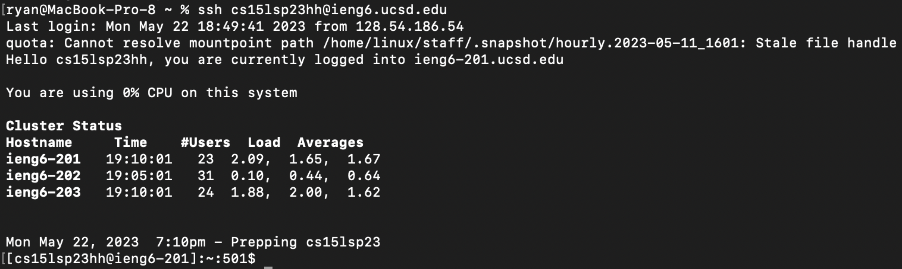
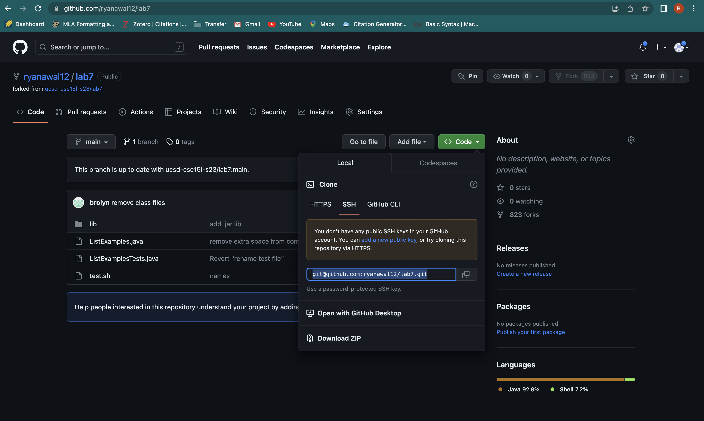
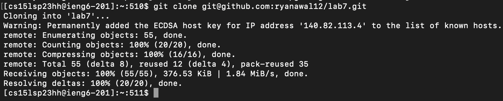
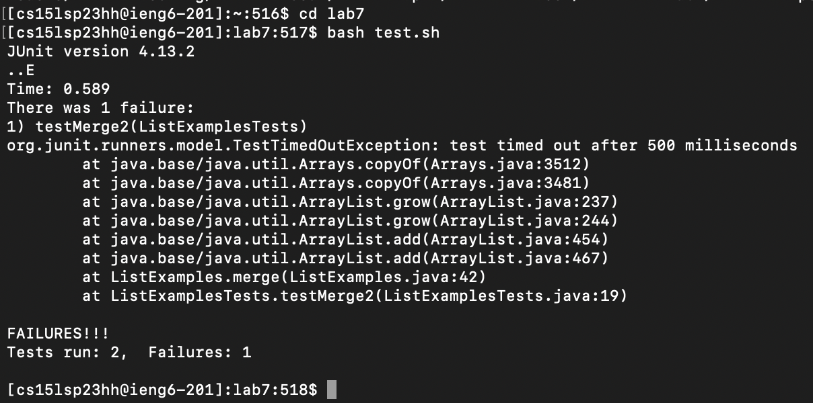
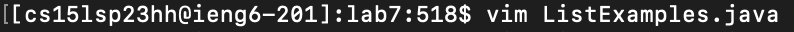
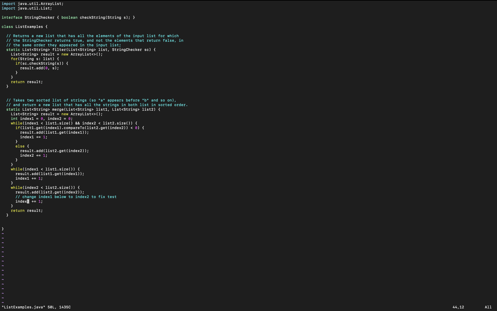
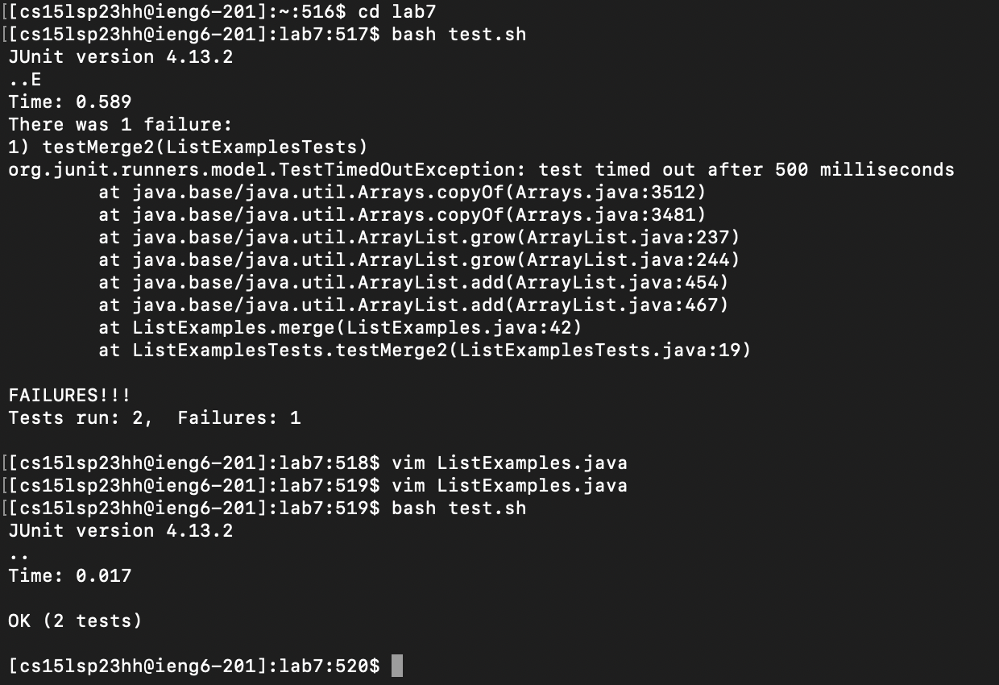
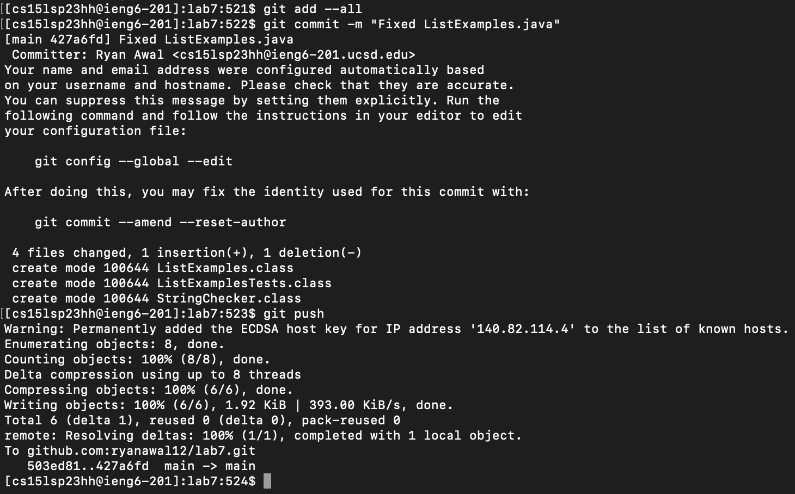

# **LAB REPORT 4 - Vim**

For this lab report, I will reproduce the tasks done in Lab 7, while summarizing each step and listing the keys pressed.

## **STEP 1 : LOGGING INTO ieng6 ACCOUNT**

### *Screenshot Of Step* 



### *Keys Pressed* 

``ssh<space>cs15lsp23hh@ieng6.ucsd.edu<return>``

### *Explanation*

As learnt in week 1, ``ssh`` is the command to log into my student account for this CSE 15L course. ``hh`` after ``cs15lsp23`` are my unique student specific letters. Due to the tasks in week 7, I had already generated an SSH key for my ``ieng6`` account, so the terminal does not prompt me for a password and I have successfully logged into my ``ieng6`` account using the ``ssh`` command.


## **STEP 2 : CLONING MY FORK OF THE REPOSITORY FROM MY GITHUB ACCOUNT**

### *Screenshots Of Step* 





### *Keys Pressed* 

``git<space>clone<space><command+v><return>``

### *Explanation*

I cloned the fork of the lab7 repository in my git account through ``git clone``. In my github account, I found the SSH fork URL and copied it to clipboard and pasted it in the terminal to be cloned using the command. 


## **STEP 3 : RUNNING THE TESTS, DEMONSTRATING THEY FAIL**

### *Screenshot Of Step*



### *Keys Pressed* 

```
cd<space>l<tab><return>
bash<space>t<tab><return>
```

### *Explanation*

First, I make ``lab7`` my current directory as the code and tests are in that directory. The tab key is like an autocomplete. As soon as there is no ambiguity in the intended path, the tab key can be used to autocomplete. Thus the effect of the first line is essentially to ``cd lab7/``
Next, I run the bash script ``test.sh``. I again make use of the tab key as autocomplete. The tests run on the faulty code and the error message that 2 tests have run and 1 has failed shows that upon the initial run, the code has a bug and needs edits.


## **STEP 4 : EDITING THE CODE TO FIX THE FAILING TEST**

### *Screenshots Of Step*





### *Keys Pressed* 

```
vim<space>ListExamples.java<return>
/index1<return><shift+n><right><right><right><right><right>xi2<esc>:wq<return>
```

### *Explanation*

I use the command ``vim ListExamples.java`` to open the code in vim. Then I use ``/index1`` to search the code for instances of 'index1' appearing. Unsatisfied that the first instance is not the one I need to edit, I then use ``<shift+n>`` to go to the next instance, which is the one I need to edit. I'm still in Normal mode at this time. I then click the right arrow 5 times to parse through the word ``index1`` until I reach '1'. I then press ``x`` to delete the character under the cursor, press ``i`` to enter insert mode and press ``2`` to change ``index1`` to ``index2``. Now that the edits are made, I press ``<esc>`` to exit insert mode. I then use ``:wq`` to save and quit. Now the bug in the code is fixed.


## **STEP 5 : RUNNING THE TESTS, DEMONSTRATING THAT THEY NOW SUCCEED**

### *Screenshot Of Step*



### *Keys Pressed* 

``<up><up><return>``

### *Explanation*

I pressed the up arrow twice to parse through my command history in the terminal and find the command ``bash test.sh`` as I had used it in STEP 3. This allowed me to skip typing again, increasing the efficiency of my task. I then pressed enter and ran the tests on the edited code. Post running, we can see that the tests were successful and we have eradicated the bug from the code.

## **STEP 6 : COMMITTING AND PUSHING THE RESULTING CHANGES TO MY GITHUB ACCOUNT**

### *Screenshot Of Step*



### *Keys Pressed* 

```
git<space>add<space>--all
git<space>commit<space>-m<space>"Fixed<space>ListExamples.java"
git<space>push
```
### *Explanation*

The first line, i.e ``git add --all``, is a command to add all changes to my account. Then, ``git commit -m "Fixed ListExamples.java"`` is used to commit these changes alongwith the message "Fixed ListExamples.java". Messages should be included with commits as when working on a collaborative project, it is helpful to track changes and update other collaborators. The last line, i.e ``git push`` is used to push local Git commits to the remote repository in github.


## **CONCLUSION**

Thus, over the course of this lab report, we have successfully retraced the steps and tasks undertaken in Lab 7 (18th May 2023). Working with vim and learning its functionalities has been very interesting and enlightening.


