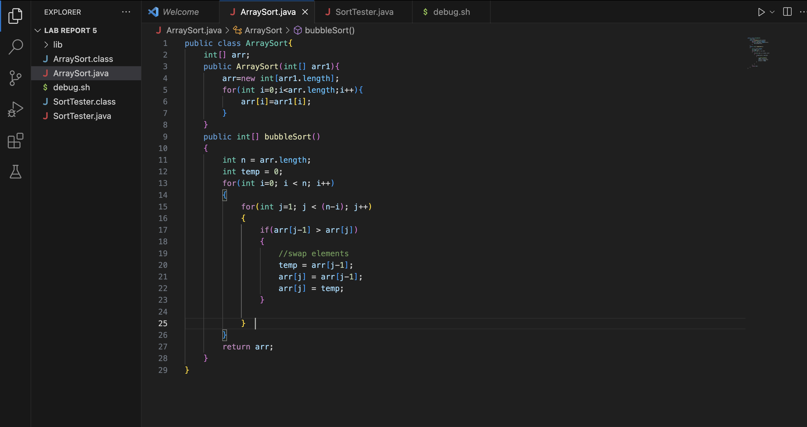
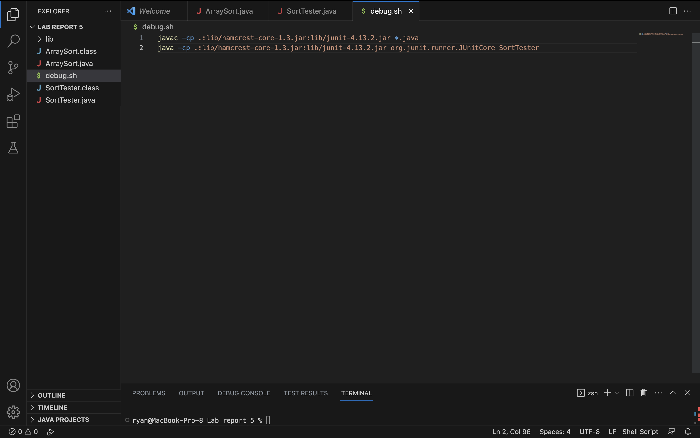
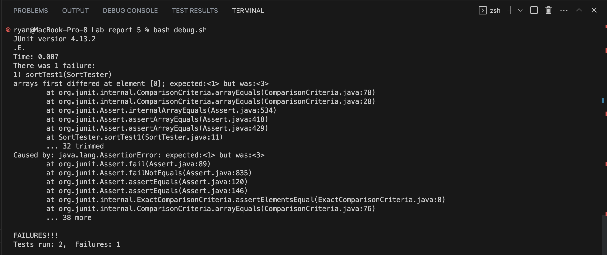
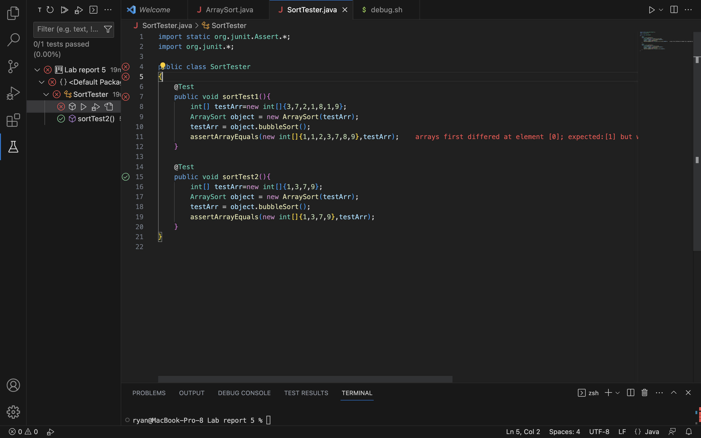
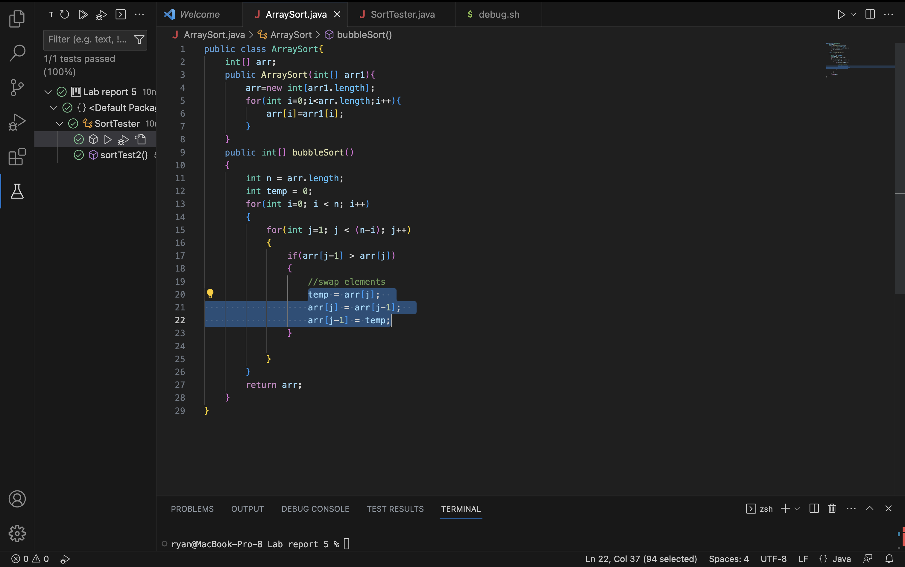
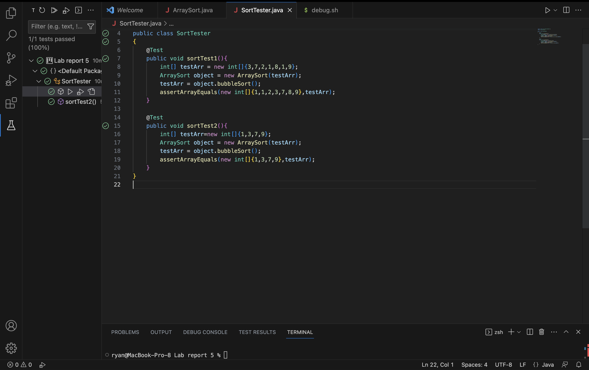
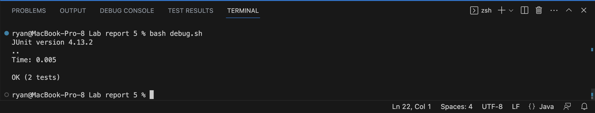
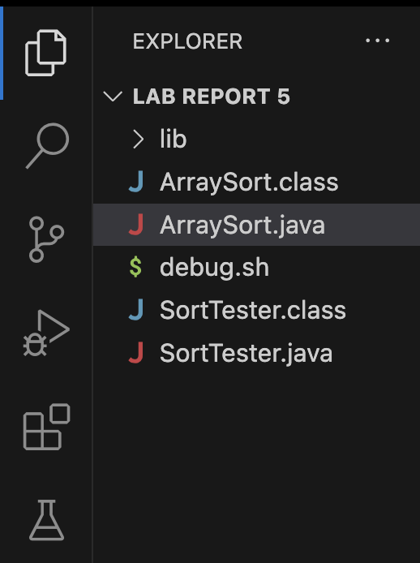

# **LAB REPORT 5 - Debugging Scenario**

## **PART 1 - EDSTEM THREAD 06/05/2023**

### **Anonymous Student:**

**Title** : Bubble Sort Debugging 

**What environment are you using (computer, operating system, web browser, terminal/editor, and so on)?**

VS Code on Macbook

**Detail the symptom you're seeing. Be specific; include both what you're seeing and what you expected to see instead.
Screenshots are great, copy-pasted terminal output is also great. Avoid saying “it doesn't work”.**

I have written the bubble sort algorithm. When I run the JUnit test, it fails. I cannot understand where the bug is in the algorithm. 
The expected output is that all tests have passed. The actual output is that one test has failed.
This is the error message shown -

```
arrays first differed at element [0]; expected:[1] but was:[3]
 at SortTester.sortTest1(SortTester.java:11)
Caused by: java.lang.AssertionError: expected:[1] but was:[3]
```

I am providing screenshots of my code and output below:










**Detail the failure-inducing input and context. That might mean any or all of the command you're running, a test case, command-line arguments, working directory, even the last few commands you ran. Do your best to provide as much context as you can.**

The failure inducing input was the array : ``int[]{3,7,2,1,8,1,9}``. The bubble sorting algorithm should return the sorted output as ``{1,1,2,3,7,8,9}``.

---
### **Helpful TA:**

Thank you for providing good context and detail to allow me to help you. 
What I would say is make sure you are **swapping array elements properly**

---
### **Anonymous Student:**

Thank you very much for your suggestion. I realized that I was assigning the value of ``arr[j-1]`` to both the temporary ``temp`` variable and ``arr[j]``. This resulted in the loss of the element at ``arr[j]`` and duplicated ``arr[j-1]``. I am sharing the updated code and terminal results
for everyone's convenience so that they do not face the same pesky bug I did. 







The bash script with the compile and run lines remain the same.
I would like to thank you for your help once again.

---
### **Helpful TA:**

No worries. Happy to help. Bugs inevitably manage to creep into our work. Sometimes all it needs is another perspective. To summarise the bug today and to recreate it for everyone's practice -

#### The file & directory structure needed

The file structure that the student used was as follows:



#### The contents of each file before fixing the bug

Contents of ``ArraySort.java``

```
public class ArraySort{
    int[] arr;
    public ArraySort(int[] arr1){
        arr=new int[arr1.length];
        for(int i=0;i<arr.length;i++){
            arr[i]=arr1[i];
        }
    }
    public int[] bubbleSort()
    {
        int n = arr.length;  
        int temp = 0;  
        for(int i=0; i < n; i++)
        {  
            for(int j=1; j < (n-i); j++)
            {  
                if(arr[j-1] > arr[j])
                {  
                    //swap elements  
                    temp = arr[j-1];  
                    arr[j] = arr[j-1];  
                    arr[j] = temp;  
                }  
                          
            }  
        }  
        return arr;
    } 
}
```

Contents of ``SortTester.java``

```
public class SortTester 
{
    @Test
    public void sortTest1()
    {
        int[] testArr = new int[]{3,7,2,1,8,1,9};
        ArraySort object = new ArraySort(testArr);
        testArr = object.bubbleSort();
        assertArrayEquals(new int[]{1,1,2,3,7,8,9},testArr);
    }
    
    @Test
    public void sortTest2()
    {
        int[] testArr=new int[]{1,3,7,9};
        ArraySort object = new ArraySort(testArr);
        testArr = object.bubbleSort();
        assertArrayEquals(new int[]{1,3,7,9},testArr);
    }
}
```

Contents of ``debug.sh``

```
javac -cp .:lib/hamcrest-core-1.3.jar:lib/junit-4.13.2.jar *.java
java -cp .:lib/hamcrest-core-1.3.jar:lib/junit-4.13.2.jar org.junit.runner.JUnitCore SortTester
```

#### The full command line (or lines) ran to trigger the bug

```
bash debug.sh
```

#### A description of what to edit to fix the bug

As mentioned by the student, the bug was the temp variable was holding the wrong value to swap in the way intended. The value of 
``arr[j-1]`` was being assigned to both the temporary ``temp`` variable and ``arr[j]``, resulting in the loss of the value in ``arr[j]``. One way to fix this is :

```
//corrected swap
temp = arr[j];  
arr[j] = arr[j-1];  
arr[j-1] = temp;  
```

Happy Coding Everyone!!

---
## **PART 2 - Reflection**

In the second part of the quarter, I really enjoyed Lab 7 - Doing it All from the Command Line. Working with ``vim`` was eye opening. The vim commands needed some getting used to but it was really fun. I talked with some of my friends who were in this course last quarter and they shared their experience working with ``nano``. They said it was much more user friendly. After some research online, I saw the same, but a site also mentioned that ``vim`` is much faster than ``nano``. I am excited to investigate the differences between these two during my spare time in the summer. Overall, this was a really fun class - the lab reports strengthened the learnings. Thank you for an amazing course!

