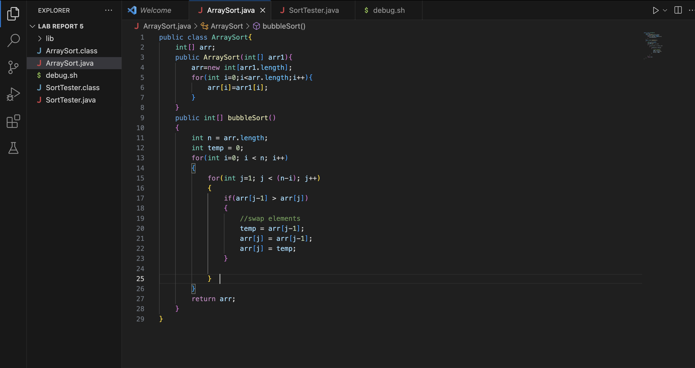

# **LAB REPORT 5 - Debugging Scenario**

## **EDSTEM THREAD 06/05/2023**

### *Anonymous Student:*

Title : Bubble Sort Debugging 

*What environment are you using (computer, operating system, web browser, terminal/editor, and so on)?*

VS Code on Macbook

*Detail the symptom you're seeing. Be specific; include both what you're seeing and what you expected to see instead.
Screenshots are great, copy-pasted terminal output is also great. Avoid saying “it doesn't work”.*

I have written the bubble sort algorithm. When I run the JUnit test, it fails. I cannot understand where the bug is in the algorithm. 
The expected output is that all tests have passed. The actual output is that one test has failed.
This is the error message shown -

```
arrays first differed at element [0]; expected:[1] but was:[3]
 at SortTester.sortTest1(SortTester.java:11)
Caused by: java.lang.AssertionError: expected:[1] but was:[3]
```

I am providing screenshots of my code and output below:




