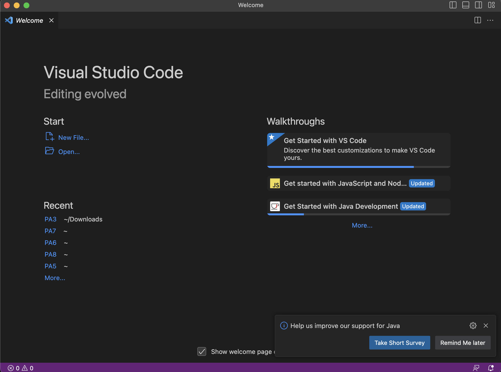

This is my Lab report for Week 1 CSE 15L lab session that happened on 04/06/2023

Step 1: INSTALLING VSCode

Above is a screenshot of the startup page of VSCode taken on my personal computer. Since I used VSCode in CSE 11, I had it pre downloaded and could skip theinstructions to download it. I just ran the application and the above is the screen that pops up soon after. From there, I clicked on Terminal --> New Terminal and that allowed me to move forward with my lab work for the day.
